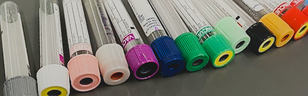
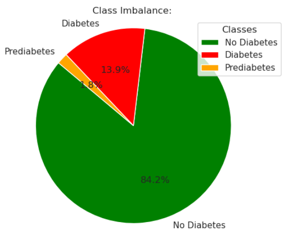
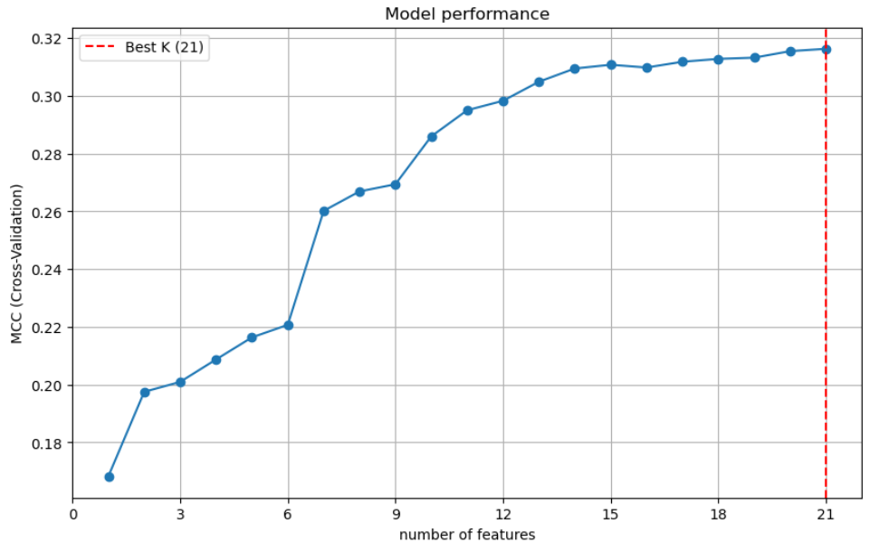
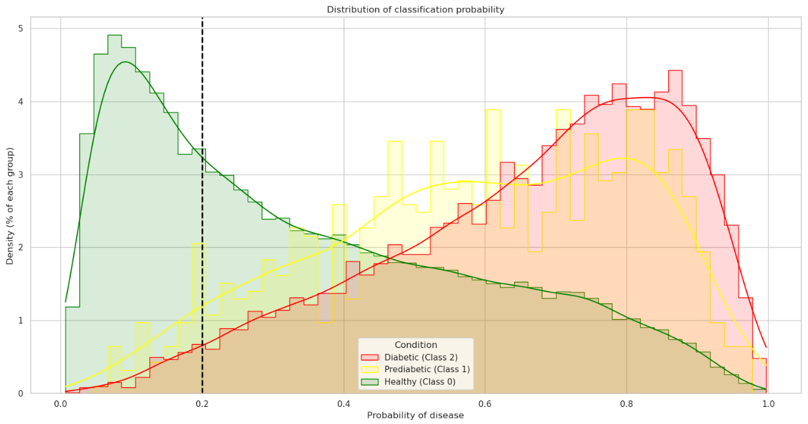
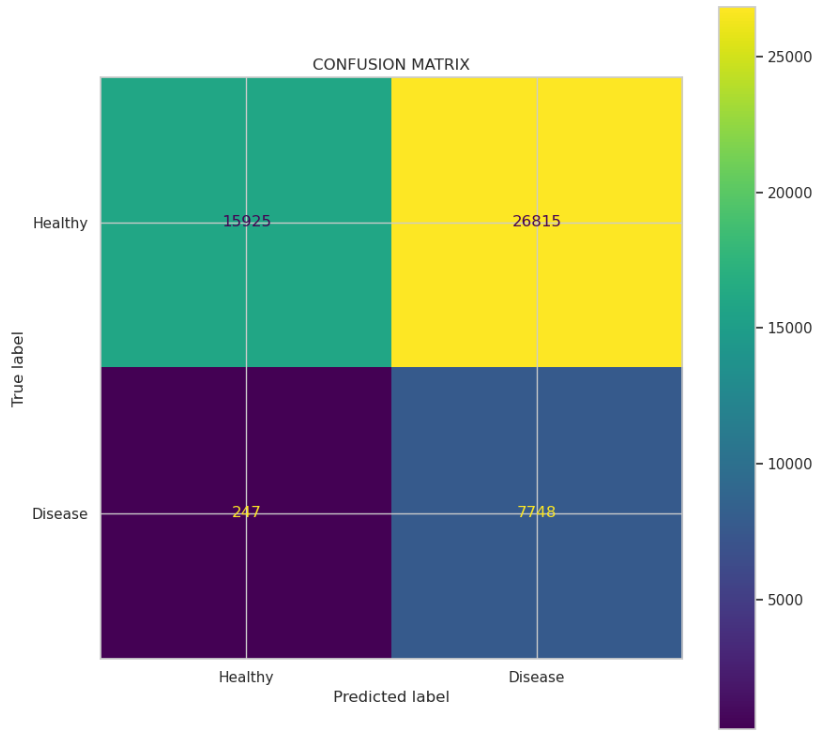

  

# Diabetes prediction machine learning project
This repository contains my project for the Applied Machine Learning course of the University of Bologna, Bioinformatics MSC.  
## Contents
##### datasets
- [multiclass dataset](./raw_datasets/diabetes_012_health_indicators_BRFSS2015.csv)
- [binary dataset](./raw_datasets/diabetes_binary_health_indicators_BRFSS2015.csv)
- [balanced binary dataset](./raw_datasets/diabetes_binary_505split_health_indicators_BRFSS2015.csv)
- [training features](./x_training.pkl)
- [training y](./y_training.pkl)
- [testing features](./x_benchmark.pkl)
- [testing y](./y_benchmark.pkl)
##### classifier
- [classifier](./classifier.pkl)  
##### scripts (in order)
1. [exploratory data analysis](./1_data_analysis.ipynb)
2. [dataset creation & initial feature selection](./2_data_processing__feature_sel.ipynb)
3. [dealing with class imbalance & second feature selection](./3_class_imbalance__feature_sel.ipynb)
4. [model selection for multiclass classification](./4_model_selection.ipynb)
5. [model selection for first-step hierarchical classification](./5_hierarchical_approach_1.ipynb)
6. [model selection for second-step hierarchical classification](./6_hierarchical_approach_2.ipynb)
7. [final binary classifier and prediction analysis](./7_final_prediction_and_plots.ipynb)
##### license
- [MIT license](./LICENSE)
##### images 
- [images](./images)

## Project summary  

### Introduction:  
Diabetes is one of the most critical global health challenges of the 21st century. However, the most alarming statistic is not the number of diagnosed patients, but the number of undiagnosed ones. A significant portion of the population lives with diabetes or prediabetes without knowing it, risking severe, irreversible long-term complications.  
Traditional diagnostic methods (blood tests, glucose tolerance tests) are invasive, costly, and require patients to physically visit a clinical facility. This creates a barrier to entry, often leaving the most vulnerable and at-risk populations "invisible" to the healthcare system until symptoms become severe.  
This project proposes a non-invasive, cost-effective alternative: leveraging behavioral and demographic data collected through annual telephone surveys to predict diabetes or prediabetes risk. The goal is not to replace clinical diagnosis, but to create an intelligent "first-line filter" that identifies at-risk individuals who require further medical attention.

### Data:
data was retrieved from Kaggle at the following link: [kaggle](https://www.kaggle.com/datasets/alexteboul/diabetes-health-indicators-dataset) and it contains 253,680 survey responses from the 2015 Behavioral Risk Factor Surveillance System (BRFSS), a health-related telephone survey that is collected annually by the Centers for Disease Control and Prevention of the United States.  It is a multiclass dataset: class 0 = healthy, class 1 = prediabetes, class 2 = diabetes. More information about data itself can be found at the previous link.  

### Goal:  
Originally the goal was to predict healty, prediabetes or diabetes using a single classifier, but data itself did not allow it since classes highly overlap. I therefore tried an hierarchical strategy employing a first classifier to distinguish between healthy (class 0) and disease (class 1 and class 2) transforming the problem from multiclass to binary, and then a second classifier to distinguish between prediabetes and diabetes. This strategy also failed since class 1 and class 2 cannot, at least with the classifiers that I choose, be distinguished.  
Finally, I settled on a binary classifier to distinguish healthy and disease, maximising recall over balance, to deliver a classifier useful for screening purposes.  

### Methods:  
The project was fully developed using Python and third-party libraries.    
[Pandas](https://pandas.pydata.org/) and [Numpy](https://numpy.org/) libraries were used to facilitate the storing and visualization of data as well as for data analisys and dataset creation.  
[Matplotlib](https://matplotlib.org/) and [Seaborn](https://seaborn.pydata.org/) libraries were used for data visalization.   
[Scikit-learn](https://scikit-learn.org/stable/) and [Imbalance-learn](https://imbalanced-learn.org/stable/) were used to perform cross-validation, model retrival and performance evaluation.  
Other third-party libraries were used for minor tasks.
##### 1. Data splits:  
Exploratory data analysis revealed high class imbalance:  
| Status | Class label | Abundance |
| --- | --- | --- |
| `Healthy` | 0 | 84.2% |
| `Pre-diabetes` | 1 | 1.8% |
| `Diabetes` | 2 | 13.9% |

Datasets have been divided into a training set, comprising 80% of the dataset, which corresponds to `202945` examples, and a testing set, comprosing 20% of the dataset which corresponds to `50735` examples. The testing set (also known as benchmark set) was only used to assess final model performance.  
Training and benchmark set were created respecting the initial dataset class abundance.  

  
*Fig 1: class imbalance pie chart*  
##### 2. Feature selection:  
Recursive Feature Elimination strategy was employed for feature selection. As classifier, [Balanced Random Forest](https://imbalanced-learn.org/stable/references/generated/imblearn.ensemble.BalancedRandomForestClassifier.html) was used since standard Random Forest failed due to class imbalance.  
##### 3. Model selection:  
The initial cohort of models comprised 7 distinct classifiers:     
| Classifier name | Type | Documentation |
| --- | --- | --- |
| Logistic Regression | regularized logistic regression | [scikit-learn](https://scikit-learn.org/stable/modules/generated/sklearn.linear_model.LogisticRegression.html) |
| Balanced Random Forest |  random forest optimized for imbalanced datasets | [imbalanced-learn](https://imbalanced-learn.org/stable/references/generated/imblearn.ensemble.BalancedRandomForestClassifier.html) |
| Histogram Gradient Boosting | histogram-based gradient boosting classification tree | [scikit-learn](https://scikit-learn.org/stable/modules/generated/sklearn.ensemble.HistGradientBoostingClassifier.html) |
| Easy Ensemble | ensemble of AdaBoost learners | [imbalanced-learn](https://imbalanced-learn.org/stable/references/generated/imblearn.ensemble.EasyEnsembleClassifier.html) |
| RUS Boost | AdaBoost with integrated random under-sampling | [imbalanced-learn](https://imbalanced-learn.org/stable/references/generated/imblearn.ensemble.RUSBoostClassifier.html) |
| Gaussian Bayes | naive bayes | [scikit-learn](https://scikit-learn.org/stable/modules/generated/sklearn.naive_bayes.GaussianNB.html) |
| Complement Bayes | naive bayes | [scikit-learn](https://scikit-learn.org/stable/modules/generated/sklearn.naive_bayes.ComplementNB.html) |

Recall, escpecially of the pre-diabetes class, and Matthews correlation coefficient (MCC) were used as primary metrics to determine model performance.  
Model selection was performed with a 10-fold cross validation approach on the training set.  
Threshold tuning was performed to maximise recall.  
##### 4. Final training:  
The final model was trained on the entire training set and it's performance evaluated on the benchmark set.  

### Results:
##### 1. Feature selection:
Feature selection did not lead to a reduction of feature to be used on subsequent steps.  
Performance of the balanced random forest (brf) peaked when all features were used.  
Subsequent steps were also performed using a reduced set of 15 features, since brf performance almost plateaued after that number of features, however, in the model selection step models trained on the reduced set of features consistently showed worse performance, ultimately leading to the full set of features to be used.  
Considering the nature of the features, that are all answers to a questionnaire, and therefore very easy to obtain, there is no strong need to reduce the number of features except in the case of performance gain.  

  
*Fig 2: Feature selection results*  
##### 2. Model selection:
Model selection process comprised of a number of substeps:  
Firstly, I considered the multiclass problem of classifying healthy, prediabetes and diabetes.  
Models were evaluated based on their MCC, recall and recall variance. Poor performers at this step (naive bayes methods and RUS Boost) were discarded, but it is important to note that all the models performed poorly, with an MCC always below 0.3, and prediabetic recall at around 2% to 3% for the best models.  
Secondly, the problem was transformed from a multiclass problem to a binary problem. Class 1 and class 2 were fused into class 1, representing unhealthy patients.  
The idea, given the initial struggles to predict 3 highly overlapping classes, was to create a 2-step classifier:  
one to predict healthy or disease    
one to predict prediabetic, diabetic or healthy, but only considering disease predictions from the first model.    
Models were evaluated based on their MCC and recall on the new binary problem. Threshold tuning was performed to maximize recall of prediabetics especially. The logic behind this choice is that, in a real case scenario is more important to detect prediabetics instead of diabetics since it is more likely that a person is prediabetic and does not know it, instead of being diabetic and not knowing it, since diabetes is a morbid medical condition that seldom goes unnoticed by the patient, while the same is not true for prediabetes.  
At this step balanced random forest and easy ensemble were discarded, and the histogram gradient boosting and logistic regression models with probability threshold of 0.2 were chosen as potential first-step classifiers.  
The last step was to select the second classifier, but for all models tested (balanced random forest , logistic regression, and histogram gradient boosting) was impossible to distinguish between the classess even after tuning the thresholds, indipendently of the classifier used to make first step classifications. High prediabetic recall was achieved with extremely low, sometimes even 0, specificity, meaning the only way the models had to achieve high recall on prediabetics was to label everyone as prediabetic.  
Looking at these results, it is clear that the only feasable strategy was to create a binary classifier to predict healthy or disease.   
The final classifier was chosen based on recall of disease class. The logistic regression classifier was chosed since it provided the highest recall of prediabetics as well as diabetics, at the cost of low specificity.

  
*Fig 3: classification probability distribution of the final classifier on the benchmark set, it is apparent the high overlap between prediabetes and diabetes classes*  

Logistic regression, given it's simplicity and low computational demands, is suited to be used for large scale predictions, for example in screening programs to select patients suitable for more expensive objective tests.  

| Metric | Result |  
| --- | --- |
| `Recall (total)` | 0.97 |
| `Recall (prediabetics)` | 0.94 | 
| `Recall (diabetics)` | 0.97 | 
| `Precision` | 0.22 |
| `Specificity` | 0.37 |
| `FPR` | 0.63 |
| `Prediabetes Misclassification Rate` | 0.06 |
| `Diabetes Misclassification Rate` | 0.03 |
| `False Positives / True Positives` | 3.5 |

Confusion Matrix (benchmark set predictions):  

Further analysis on false positive and false negative predicitons can be found in [script 7](./7_final_prediction_and_plots.ipynb).
